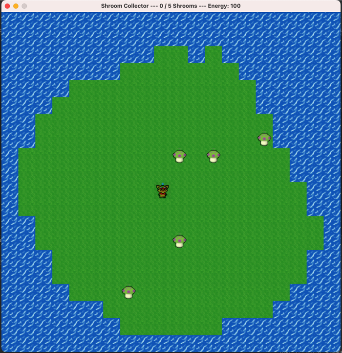
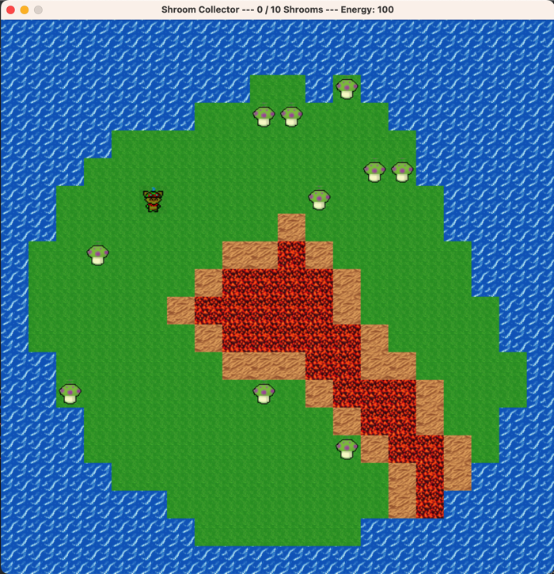

# So you want to make AI bots? A gentle intro into reinforcement learning.

## Prerequisites:

```text
Python 3.9.13
```

If you are using [pyenv](https://github.com/pyenv/pyenv) (a great way to manage python versions on your machine)

```bash
pyenv install 3.9.13
pyenv global 3.9.13
```

then if you're PC/non-M1 Mac:
```
pip install `requirements.txt` 
```
... into a virtual environment using your preferred tool of venv/poetry/pipenv etc.

Important - if you have a M1 mac, use the alternate `requirements-m1-mac.txt` file,

To test if everything is running, from the top level folder run:

```bash
python rl_cli.py play --env grassy_island_env
```

This should pop up a human playable version of the first level we'll solve. Move the shroom collector with WSAD.



## What is reinforcement learning?

### Markov Decision Processes

This article is a good crash course:
[A Crash Course in Markov Decision Processes, the Bellman Equation, and Dynamic Programming](https://medium.com/mlearning-ai/a-crash-course-in-markov-decision-processes-the-bellman-equation-and-dynamic-programming-e80182207e85)

## The Problem

This project contains three "unsolved" environments built around variations of a simple game "Shroom Collector".

For this lab we'll ignore tuning the policy / model and focus on what we can do adjusting the observational_space and rewards. 

If you're wanting to change this, the auto-generated model is set here.

It's using the PPO policy, which there's a good video here

### The labs

In each of the following labs, you will edit the *_env.py file as needed. At the very least you will need to define an observational space and reward signal.

For example, in the grassy_island_env.py, this means

1. defining the shape of your observation_space. Read more about gym [spaces](https://www.gymlibrary.dev/api/spaces/) here.
2. Populating said observation_space by encoding game state data which will be your policy/model's input and what the agent can "see".
3. Determining a reward based upon different conditions.

For each of these you can look at [demo_env.py](rl/envs/demo_env.py) for starting examples.

### grassy_island_env

[grassy_island_env.py](rl/envs/grassy_island_env.py)

Our intrepid shroom collector needs to gather mushrooms for battle!

Every move made costs energy, mushrooms spawn randomly, each mushroom gathered gains 50 energy-- the objective is to gather 5 mushrooms for battle.

What **observational_space** & **rewards** can help train our AI to consistently win this game?

Once you have an observational space and reward you're happy with you can train with:

```bash
python rl_cli.py train --experiment_name=grassy_island_env --env=grassy_island_env --iterations=20
```

Note, experiment_name can be anything. It's just the folder your policy checkpoints / logs /metrics are stored.

Watch the reward metrics. Are the rewards trending up?

Watch the episode_len_mean. Is it trending down?

If you have a good observation_space defined, and a good strategy with rewards you will see reward averages go up and episode_len go down.

If you want to see your agent play:

```bash 
python rl_cli.py eval --experiment_name=grassy_island_env --env=grassy_island_env
```
Note, experiment_name can be anything. It's just the folder your policy checkpoints / logs /metrics are stored.

It will be found under a folder `ray_results` in the root of the project after training.

### eruption_env

[eruption_env.py](rl/envs/eruption_env.py)

Oh no! the island has erupted spewing lava! If our brave shroom collector steps in the lava, he will die!

On top of that he needs to collect 10 shrooms now since he needs to save up until the lava subsides.

What observational_space and rewards can help train our AI to consistently win this game?

Once you have an observational space and reward you're happy with you can train with:
```bash
python rl_intro.py train --experiment_name=eruption --env=eruption_env --iterations=20
```
Note, experiment_name can be anything. It's just the folder your policy checkpoints / logs /metrics are stored.

Watch the reward metrics. Are the rewards trending up?

Watch the episode_len_mean. Is it trending down?

If you want to see your agent play:

```bash 
rl_intro.py eval --experiment_name=eruption --env=eruption_env
```

### maze_env.

This one is tricky. Same as above, just use `maze_env`. 